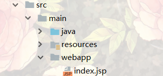

#  sparrow: A pretty lightweight java web framework


[](https://search.maven.org/search?q=g:%22com.github.racaljk%22%20AND%20a:%22sparrow%22)

[中文](README.md) |
[English](README_EN.md)

sparrow是一个轻量级的java web框架。"麻雀虽小五脏俱全"，sparrow虽然轻量小巧，但包含了web开发所有必要的基础设施，
它还集成了一些第三方框架，以此实现最大程度的灵活性和可用性。

在开始使用前，需要在`pom.xml`中添加并导入sparrow依赖
```xml
<dependency>
    <groupId>com.github.racaljk</groupId>
    <artifactId>sparrow</artifactId>
    <version>1.0.1-snapshot</version>
</dependency>
```
或者也可以下载sparrow jar并手动配置buildpath.准备好依赖后让我们开始吧！

# 预先集成
sparrow预继承了一些第三方框架，用户可以根据需要选择是否禁用。

| Name | Status |
| :---: | ------ |
| | 默认集成 |


# 示例
## 1：hello sparrow

新建一个类如`HelloSparrow.java`:
```java
import java.io.IOException;

public class HelloSparrow {
    public static void main(String[] args) {
        Router.get("/hello", (req, resp) -> {
            try {
                resp.getWriter().println("hello world");
            } catch (IOException e) {
                e.printStackTrace();
            }
        });
        Sparrow.fly();

    }
}
```
启动后浏览器输入`localhost:8080/hello`即可看到页面渲染结果。

另外，Sparrow默认支持jsp+servlet混合模式。Sparrow默认存放jsp的文件夹是`src/main/webapp`，
所以要使用jsp，首先要新建该文件夹：



现在访问`localhost:8080/index.jsp`就能渲染jsp页面。

如果需要自定义jsp存放目录，那么在`Sparrow.fly()`前指定即可：
```java
Configurator.setJspBase("my_favorite_path/");
```
更多配置选项请参见文档。

## 2：用户登录
总是hello world多无聊，这个示例将进一步，做一个有实际意义的登录页面，嗯...这里的实际意义指的是他的用途而不是这个示例：

老规矩新建`src/main/webapp`文件夹，加入一个`login.jsp`：
```java
    <form action="/loginCheck" method="post">
        Username: <label><input name="username" type="text"/></label><br/>
        Email: <label><input name="email" type="email"/></label><br/>
        Password: <label><input name="password" type="password" /></label><br/>
        <label><input name="submit" type="submit"/> </label>
    </form>
```
用户点击提交后会跳转到`/loginCheck` ,那么我们还得写个`/loginCheck`的逻辑：
```java
public class LoginPage {
    private static final String USER_NAME = "yang";
    private static final String PASS_WORD = "400820";

    public static void main(String[] args) {
        Router.post("/loginCheck", model->{
            if(model.get("username").equals(USER_NAME) && model.get("password").equals(PASS_WORD)){
                return View.ok();
            }
            return View.error();
        });
        Sparrow.fly();
    }
}
```
`model.get()`方法可以获取用户提交的表单数据，如果数据有多个如`option,select`等则需要`model.getMulti()`。
这里的判断实在太简单了，实际情况下更可能是从数据库检索用户名密码是否匹配。最后根据匹配结果返回视图。

视图是一个抽象的概念，它关联逻辑页面和页面数据。sparrow会负责页面选择，渲染和数据的填充。
在这里，用户只需要关系要跳转的页面是哪个，需要给这个页面哪些数据。


# 文档
## 1.路由
在sparrow中定义一个路由非常方便，有多种方式可供选择：
```java
public class DefineRouter {
    public static void main(String[] args) {
        // 路由到html
        Router.get("/a",model -> View.create("home.html"));

        // 路由到jsp
        Router.get("/b",model-> View.create("index.jsp"));

        // 返回带模型的视图，随后sparrow会负责视图解析
        Router.get("/d",model -> {
            model.set("greeting","hi");
            return View.create("home.html",model);
        });

        // 直接使用原生servlet，不经过视图解析
        Router.get("/c",(req,resp)-> {
            try {
                resp.getWriter().println("<p>rendering page without view resolving</p>");
            } catch (IOException e) {
                e.printStackTrace();
            }
        });

        Sparrow.fly();
    }
}
```

## 2.配置
可以通过配置改变sparrow的内部行为，预定义配置及更改配置方法如下：

| 配置项 | 默认 | 选项 |
| :-----: | ----- | ----- |
| jsp存放位置 | `src/main/webapp/` | Configurator.setJspBase(docPath) |
| 集成thymeleaf | 默认集成 | Configurator.disableThymeleaf() |
| sparrow配置文件名 | `sparrow.properties` | Configurator.setSparrowProperties(propertiesFileName) |
