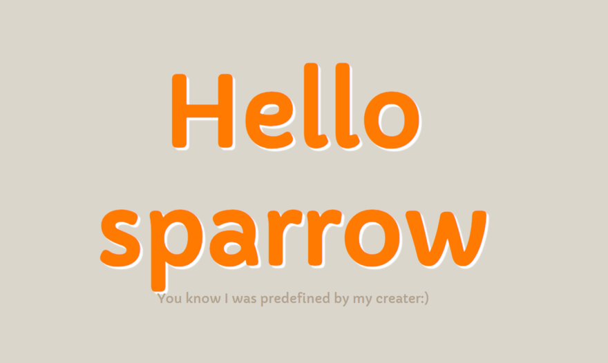

#  sparrow: A pretty lightweight java web framework


[](https://search.maven.org/search?q=g:%22com.github.racaljk%22%20AND%20a:%22sparrow%22)

[中文](README_CN.md) |
[English](README.md)

**sparrow** is a lightweight java web framework. It's tiny and lightweight but actually contains almost all infrastructural tools and utilities for web developing. Besides, sparrow integrates some full tested third-party libraries/frameworks such as thymeleaf template engine and redis in-memory database
so that we don't need to invent everything we use.

To use sparrow, we need add its dependencies in `pom.xml`and import it:
```xml
<dependency>
    <groupId>com.github.racaljk</groupId>
    <artifactId>sparrow</artifactId>
    <version>1.0.3-snapshot</version>
</dependency>
```
Or you can download `sparraw.jar` and append relative dependencies into your IDE's `buildpath`
 (Not recommend since there are many dependencies and we have to download them manually and check their version one by one... that's definitely ineffective and error-prone).


# Integration
By default, sparrow integrates some widely used third-party frameworks.
You can disable them or change predefined configurations of them.

| Name | Status |
| :---: | ------ |
| | Integrated |
| | Integrated |


# Demos
## 1：hello sparrow

Create a file named `HelloSparrow.java`:
```java
import java.io.IOException;

public class HelloSparrow {
    public static void main(String[] args) {
        Router.get("/hi", (req, resp) -> {
            try {
                resp.getWriter().println("hello world");
            } catch (IOException e) {
                e.printStackTrace();
            }
        });
        Sparrow.fly();

    }
}
```
That's all we need to do if we use sparrow! We are no longer need to download tomcat server, check its version with your local jdk, configure it, write web.xml or use @WebX annotations, and so on...
That's so damn work for novice. Here we just open browser and access `localhost:8080/hello` we will see our works, that is, a simple greeting message:)
And more interesting, sparrow pre-defines a `/hello` page, it shows a friendly message for those new users:



Moreover, sparrow internally supports `jsp`+`servlet` mixed mode.
The default `jsp` base directory is `src/main/resources`, which is relative to your project path.
We need to create that directory if we want to use jsp:


Now access `localhost:8080/index.jsp`, your newly created `jsp` page would be rendered soon.

You can also specify a different jsp base before starting sparrow, it barely requires you to call a method and pass your favorite path argument:
```java
Configurator.setJspBase("my_favorite_path/");
```
For more details about various configurations and their explanations, see sparrow's corresponding documentation.

## 2：User login
Writing hello world tend to be somewhat boring, so here we will illustrate a useful login page:

As I said before, createing a directory `src/main/resources` and putting `login.jsp` into that dir firstly：
```java
    <form action="/loginCheck" method="post">
        Username: <label><input name="username" type="text"/></label><br/>
        Email: <label><input name="email" type="email"/></label><br/>
        Password: <label><input name="password" type="password" /></label><br/>
        <label><input name="submit" type="submit"/> </label>
    </form>
```
Sparrow would forward user's request to `/loginCheck` as long as submit button was be clicked.
Now we need to write corresponding login checking logic:

```java
public class LoginPage {
    private static final String USER_NAME = "yang";
    private static final String PASS_WORD = "400820";

    public static void main(String[] args) {
        Router.post("/loginCheck", model->{
            if(model.get("username").equals(USER_NAME) && model.get("password").equals(PASS_WORD)){
                return View.ok();
            }
            return View.error();
        });
        Sparrow.fly();
    }
}
```
The method `model.get()` retrives user submitted form data and match them with given username and password,
then redirect to new age according to matching result. In a real world practise, it's more likely to query
username and password from remote database. So let's move on next section, we will demonstrate how to use `sparrow`
database template to facilitate our redundant CRUD works.

## 3: Facilitate CRUD by using sparrow database template
First, you need to specify your database connection information in `src/main/resources/sparrow.properties`.
Configuration items are self-explanatory:
```properties
database.username=root
database.password=root
database.url=jdbc:mysql://localhost:3306/videohub?serverTimezone=GMT
database.driver-class=com.mysql.jdbc.Driver
```
When you configured above properties, you can use sparrow database template. It's pretty easy to use,
and thanks to java 8 lambda we have even more concise code:
```java
DBTemplate.queryOne("select * from videohub_user where id=1", result->{
    System.out.println(result.getString("username"));
    System.out.println(result.getString("email"));
    System.out.println(result.getString("password"));
});

DBTemplate.queryList("select * from videohub_resource", result->{
    // print video title and name for each row
    System.out.println(result.getString("video_title"));
    System.out.println(result.getString("video_file_name"));
});
```
As client programmer(I means, those who are using libraries to code awesome products), we don't need to
manipulate connections, create statement, execute staetment and release resources and so on,
all we need is to code SQL and retrieve useful column from result set.

# Documentation
## 1.Router
There are many ways to define user routers, you can choose your favorite one：
```java
// Route to html
Router.get("/a",model -> View.create("home.html"));
```
```java
// Route to jsp
Router.get("/b",model-> View.create("index.jsp"));
```
```java
// Returm a model bundled view, it will be resolved by sparrow later
Router.get("/d",model -> {
    model.set("greeting","hi");
    return View.create("home.html",model);
});
```
```java
// Use native servlet and ignore view resolving phase
Router.get("/c",(req,resp)-> {
    try {
        resp.getWriter().println("<p>rendering page without view resolving</p>");
    } catch (IOException e) {
        e.printStackTrace();
    }
});
```

## 2. Database template
Sparrow database template provides a simple way to do CRUD works
 without caring about connection getting and resource releasing. Public APIs of it are as follows:
```java
public class DBTemplate{
    // Get one row by given sql
    public static void queryOne(String sql, Row row);
    // Get multi rows by given sql
    public static void queryList(String sql,MultiRow multiRow);
}
```
## 3.Configuration
You can change sparrow's intrinsic behaviors by calling `Configurator` methods.
These methods are as follows：

| Item | Default | Option |
| :-----: | ----- | ----- |
| jsp base dir | `src/main/resources/` | Configurator.setJspBase(docPath) |
| integrate thymeleaf | Yes | Configurator.disableThymeleaf() |
| sparrow properties namr | `sparrow.properties` | Configurator.setSparrowProperties(propertiesFileName) |

# Contribute
Please feel free to pull your patchs and enhancements, I will accept them unless they have some fatal problems.
Any questions/proposals which related to `sparrow` are welcomed, I will reply them in free time.

# License
`Sparrow` was licensed under the [MIT](LICENSE) license.
